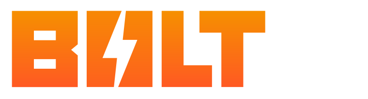

A lightning-fast boilerplate for building Figma Plugins in Svelte, React, or Vue built on Vite + TypeScript + Sass


[](https://github.com/hyperbrew/bolt-figma/blob/master/LICENSE)
[](https://discord.gg/PC3EvvuRbc)

## Features

- Lightning Fast Hot Reloading on changes
- Setup with TypeScript Definitions for Figma in UI and Code Contexts
- Optimized Build Size
- Bundling in UI and Code contexts
- Spin a up a new project in Svete, React, or Vue
- Easily configure in figma.config.ts

#### Pending Features:

- Easy Package to ZIP archive with sidecar assets (pending)
- GitHub Actions ready-to-go for zip Releases (pending)

## Backers

Huge thanks to our backers who have made this project possible!

### Founding Backers

_Founding backers have made substantial contribution to the project at the start which has made this project possible._

<a href="https://figma.com/" target="_blank">
</a>

...

### Feature Backers

_Feature backers have sponsored individual features that have made this project better for the whole community._

<a href="https://battleaxe.co/" target="_blank">
</a>

...

If you're interested in supporting this open-source project, please [contact the Hyper Brew team](https://hyperbrew.co/contact/).

## Support

### Free Support

If you have questions with getting started using Bolt Figma, feel free to ask and discuss in our free Discord community [Discord Community](https://discord.gg/PC3EvvuRbc).

### Paid Support

If your team is interested in paid consulting or development with Bolt Figma, please [contact the Hyper Brew team](https://hyperbrew.co/contact/). More info on our [Custom Plugin Development & Consulting Services](https://hyperbrew.co/landings/boost-development)

## Prerequisites

- [Node.js 18](https://nodejs.org/en/) or later
- [Yarn](https://classic.yarnpkg.com/lang/en/docs/install/) ( ensure by running `yarn set version classic` )
- Figma Desktop App

## Quick Start

`yarn create bolt-figma` - Create a new plugin with the create script

`cd my-plugin` - Change to the new plugin directory

`yarn` - Install Dependencies (if not already done by create command)

`yarn build` - Build the plugin (must run before `yarn dev`, can also run after for panel to work statically without the process)

`yarn dev` - Run the plugin in hot reload mode for development with UDT (see below)

Write frontend UI code in `src/main.svelte`

Write backend figma code in `src-code/code.ts`

### Add Plugin to Figma

1. Open Figma
2. Select Figma Menu > Plugins > Development > Import Plugin from Manifest
3. Select the `manifest.json` file in the `dist` folder
4. Your plugin can now be launched from the menu or managed under "Manage Plugins"

### Load and Debug Plugin

1. Launch your plugin by going to `Figma Menu > Plugins > Development > "Your Plugin"`
2. Ensure Hot Reloading is checked under `Figma Menu > Plugins > Development > Hot Reloading Plugin`
3. Open the Dev Tools console with `Figma Menu > Plugins > Development > Show/Hide Console`

### Info on Build Process

Frontend code is built to the `.tmp` directory temporarily and then copied to the `dist` folder for final. This is done to avoid Figma throwing plugin errors with editing files directly in the `dist` folder.

The frontend code (JS, CSS, HTML) is bundled into a single `index.html` file.

The backend code is bundled into a single `code.js` file.

Finally the `manifest.json` is copied from the public folder as is.

### Troubleshooting Assets

Figma requires the entire frontend code to be wrapped into a single HTML file. For this reason, bundling external images, svgs, and other assets is not possible.

The solution to this is to inline all assets. Vite is already setup to inline most asset types it understands such as JPG, PNG, SVG, and more, however if the file type you're trying to inline doesn't work, you may need to add it to the assetsInclude array in the vite config:

More Info: https://vitejs.dev/config/shared-options.html#assetsinclude

Additionally, you may be able to import the file as a raw string, and then use that data inline in your component using the `?raw` suffix.

For example:

```ts
import icon from "./assets/icon.svg?raw";
```

and then use that data inline in your component:

```js
// Svelte
{@html icon}

// React
<div dangerouslySetInnerHTML={{ __html: icon }}></div>

// Vue
<div v-html="icon"></div>
```
